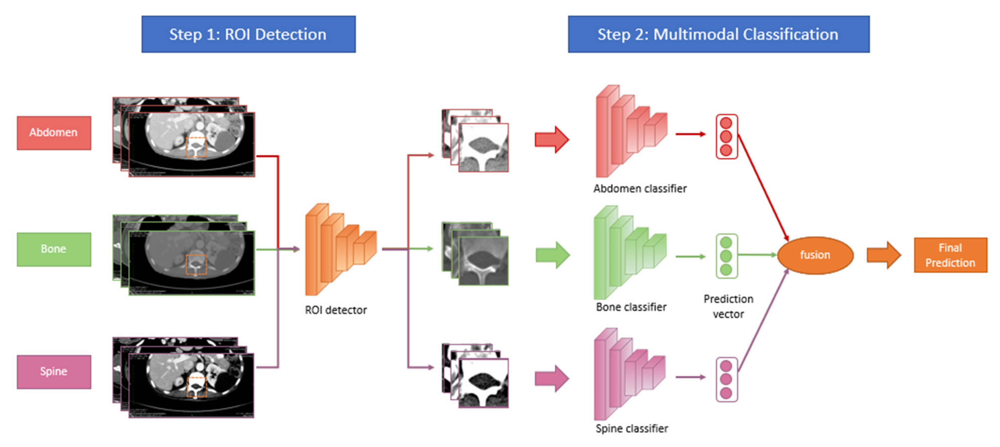

# SpineAI-Bilsky-Grading-CT
<h1 align="center">
  <p align="center">SpineAI Paper with Code</p>
  
</h1>


## Bilsky-Grading model
An overview of the proposed Multi-Window Bilsky-Grading model.
<div align=center></div>

## Environment

- Python==3.7.4
- Pytorch==1.2.0


## Run the code
bash train.sh

## Training visualization

$ tensorboard --logdir path_to_current_dir/logs


## 🤝 Referencing and Citing SpineAI

If you find our work useful in your research and would like to cite our paper, please use the following citation:

```
@article{hallinan2022deep,
  title={Deep Learning Model for Grading Metastatic Epidural Spinal Cord Compression on Staging CT},
  author={Hallinan, James Thomas Patrick Decourcy and Zhu, Lei and Zhang, Wenqiao and Kuah, Tricia and Lim, Desmond Shi Wei and Low, Xi Zhen and Cheng, Amanda JL and Eide, Sterling Ellis and Ong, Han Yang and Muhamat Nor, Faimee Erwan and others},
  journal={Cancers},
  volume={14},
  number={13},
  pages={3219},
  year={2022},
  publisher={MDPI}
}
```

## :mailbox: Contact

Address correspondence to J.T.P.D.H. (e-mail: james_hallinan AT nuhs.edu.sg)

### _Disclaimer_

_This code base is for research purposes and no warranty is provided. We are not responsible for any medical usage of our code._


